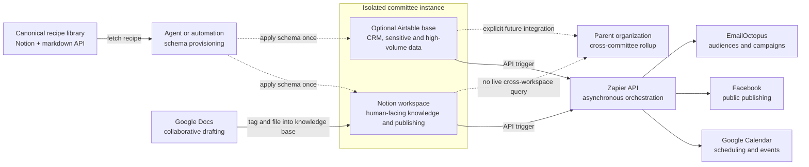

# Committee platform architecture

Solution-agnostic technical strategy and philosophy. States the environment, constraints, and decision framework this solution operates within — it does not mandate specific MVP features (see `docs/developer/approach/`) or business requirements (see `manifest/`), per the MKA architecture/approach boundary.

## Philosophy

- **Text-first, markdown-first knowledge posture.** Structured and narrative knowledge is kept in human-readable, machine-parseable text wherever practical (mirrors mka-bootstrap's own posture, see [knowledge-management.md](knowledge-management.md)).
- **Federation over centralization.** Each committee gets its own isolated instance rather than a shared multi-tenant database. Isolation is the default; cross-instance integration is an explicit, designed feature, not an assumption.
- **Recipes are applied once, not synced live.** Shared knowledge (best-practice configuration, schema, process) is consumed from a canonical source at setup/extension time and then diverges with the instance. Ongoing synchronization is a deliberate, separately-designed capability, not a default.
- **Prefer platform-native capability over custom-built equivalents** — but only after weighing cost and control tradeoffs explicitly. Native features (e.g., AI transcription) are frequently gated behind paid tiers independent of how they're invoked; that cost is treated as a first-class architectural input, not an afterthought.
- **Human-facing and machine-oriented data are architecturally separate.** What a person is meant to read/edit and what a machine is meant to log/process are held in different systems by default, to keep human-facing surfaces legible.
- **Schema-as-code, scoped to schema only.** Structure (properties, tables, fields) is managed declaratively and idempotently; content/records are not treated as IaC-managed state.

## Architecture at a glance

The platform is federated: a canonical recipe library provisions each committee's isolated workspace, while API-driven automation connects that workspace to external publishing, scheduling, and email surfaces. Solid arrows represent supported data or control flows; dashed arrows represent one-time consumption or explicitly deferred integration.

## Platform landscape

| Platform | Role |
|---|---|
| Notion | Primary human-facing document/knowledge system, publishing surface, and canonical recipe-library host (dual human + agent consumption via its markdown API). |
| Airtable | Structured, relational, high-volume, or sensitive data (CRM, interaction logs, analytics) that would clutter a human-facing Notion view. |
| Zapier | Cross-system automation/integration layer, driven exclusively through its API (not the no-code UI builder), for reviewability and version control. |
| Google Docs | Long-form collaborative drafting endpoint for organizations already using it; bridged into Notion via a tag-and-file pattern rather than replacing it outright. |
| Google Calendar | Scheduling coordination and a public event-publishing target. |
| Facebook | Public social publishing surface and a source of public engagement data. |
| EmailOctopus | Outbound email layer (audience management, campaign sends, drip sequences). |

## Constraints

- **No live cross-workspace query.** Notion API access is scoped per-workspace. Federation therefore implies genuinely isolated instances; any parent-organization rollup or cross-instance visibility is an explicit integration to design, not something the platform gives for free.
- **Not built for high-frequency or synchronous writes.** Notion's API rate limits and lack of granular webhooks mean automation should assume asynchronous/polling patterns rather than synchronous request chains.
- **Native AI features are cost-gated by entitlement, not by invocation method.** Whether a native capability (e.g., AI transcription) is triggered live in-app or headlessly via API, the same paid-tier requirement applies. Recording or triggering "outside" the platform does not bypass platform-side licensing costs.
- **No mature IaC tooling exists for Notion or Airtable.** Neither has an officially maintained Terraform provider or drift-detection tooling; schema management must be bespoke, idempotent reconciliation scripts against declarative schema files, scoped to schema only.
- **Markdown representation is lossy for some content.** Notion's markdown API cleanly represents most block types, but a handful (bookmarks, embeds, link previews, breadcrumbs) render as opaque placeholders. Content meant for agent consumption (e.g., recipes) should avoid relying on those block types.

## Decision framework: data placement

1. Human-facing, narrative, or comparatively low-volume structured content → **Notion**.
2. Structured, relational, high-volume, or sensitive data → **Airtable**.
3. Cross-system orchestration and triggers → **Zapier**, API-driven only.
4. Long-form collaborative drafting for organizations already invested in it → **Google Docs**, bridged into the Notion knowledge base rather than replaced.

This split is the primary architectural rule for deciding where any given piece of information lives; approach-level documents apply it to specific requirements.

## Federation & recipe-library model

- One instance (a Notion workspace, optionally paired with an Airtable base) per committee — not one shared instance per parent organization.
- A separate, canonical recipe-library knowledge base — itself living in Notion, authored as markdown-compatible content — that an agent or automation fetches (via Notion's markdown API) to provision or extend a specific committee instance.
- Recipes are consumed once and cited back to their canonical source; they are not kept in a continuously-synced relationship with it. Whether a "recipe updated, should this instance reapply it" mechanism is ever built is an explicit future decision, not assumed.
- Cross-committee rollup reporting for a parent organization is an explicit, separately designed integration, because no native mechanism provides it.

## Extension points explicitly deferred

- **Bubble** as a custom-built portal/app layer — only if a concrete use-case emerges that Notion/Airtable's native sharing, forms, and views cannot satisfy.
- **Notion Agents** (native Slack/Mail/Calendar/MCP automation) as a replacement for custom Zapier-driven automation — a build-vs-use-native tradeoff to evaluate explicitly, not default to either direction.
- **Audit-trail rigor** beyond each platform's native version history, for governance records (votes/decisions) that may carry legal or organizational weight.

## References

- [knowledge-management.md](knowledge-management.md) — MKA documentation architecture and text-first posture
- [notion-architecture-brainstorm.md](notion-architecture-brainstorm.md), [problem-space-brainstorm.md](problem-space-brainstorm.md), [use-case-tool-mapping-brainstorm.md](use-case-tool-mapping-brainstorm.md) — source brainstorms this architecture distills
- [notion-ai-meeting-notes-briefing.md](notion-ai-meeting-notes-briefing.md) — detail behind the AI-feature cost-gating constraint
- [missives/2026-09-20-architecture-brainstorm-meeting-notes.md](../../missives/2026-09-20-architecture-brainstorm-meeting-notes.md) — meeting record this architecture was distilled from
